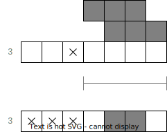

# Algorithm
*This document assumes that you know what a nonogram is and how to solve them.*

The following terms are used throughout the document and source code:
* **Cell**: A cell on the nonogram grid.
* **Box**: A filled cell.
* **Space**: An space "X" cell.
* **Chain**: A chain of boxes defined by one of the numbers outside the grid.
* **Range**: Refers to the range of positions a chain could have.

The approach this algorithm takes is to narrow down the location of each chain.
Then spaces and boxes are filled in and the process is repeated until the nonogram is solved.

## Narrowing down the location
To narrow down the location three techniques are used.
These have to be applied in order!
We will only take a look at how to find the start of the range.
Finding the end is the same process just in the opposite direction.

### 1. Update start by box at end
If there are boxes on the right of this chain, 
which cannot be covered by another chain on the right,
then they must belong to this chain.
In the example below, we can set the start of the range of the first chain to the indicated area.

How to implement:
* Take the start of the chain of the right (if there is any).
* Iterate backward.
* Stop at the first box with the same color.
* Subtract the length of the chain.

See: `nonogram_rs::algo::chain::Chain::update_start_by_box_at_end`

### 2. Update start by adjacent
Two chains with the same color cannot be adjacent to each other.
Thus, if the cell to the left of the start is a box with the same color, 
we have to set the start past these boxes.

How to implement:
* Look at the cell to the left of the start (if there is any).
* Check if it is a box of the same color.
* If yes, advance by one and repeat.

See: `nonogram_rs::algo::chain::Chain::update_start_by_adjacent`

### 3. Update start by gabs
This one is very straightforward, a chain cannot overlap with spaces or boxes with a different color.
If the area after the start is blocked by spaces (or boxes) we have to set the start past them.

How to implement:
* Iterator the cells past the start.
* If it is empty or a box with the same color, count up.
* If it is a space or a box with a different color, reset the count to zero.
* Continue until the count is equal to the length of the chain.

See: `nonogram_rs::algo::chain::Chain::update_start_by_gabs`

## Multiple chains
So far we only looked at how to apply these techniques to one chain.
Now comes the most difficult part: piecing them together.
There is an example below to help you understand the process.

We start by iterating all chains of this line, **but in reverse**.
This is required because to apply technique one, we need the start of the chain on the right.
If we start from the left, then the chain on the right still has an outdated range start.
We can't know where the right chain starts if we have not taken a look at it yet.

With that out of the way, we can apply all techniques to each chain.
Except that there is yet another catch.
In most cases, all chains will end up with a range starting at the very beginning of the line.
To avoid this, we need to check that the leftmost position of the current chain 
does not overlap with the range of the chain on the right.
If it does, we need to reevaluate the right chain but use a range start that respects the current chain.
It might be required to backtrack multiple chains.

See: `nonogram_rs::algo::line::Layout::update_starts`

## Filling in the nonogram
After we updated all ranges, we can start filling in the nonogram.
This is rather simple:
* Every cell which is outside all ranges must be a space.
* The overlap of the leftmost and rightmost positions of a chain are boxes.

## Solving the nonogram
We have narrowed down the location of each chain and filled in the nonogram.
Now we repeat this process until no more improvement can be archived.
This can be the case for two reasons, either we solved it, or it is a nonogram that requires recursion.

If it does require recursion, we look for the first chain which has not been resolved.
Unless a chain is resolved, the first and last cells are always empty.
And because we look for the first cell of the first unresolved chain, it can only be in the range of this chain.
This means that, if the cell is a box, it must have the same color as the chain.

Now we fork the nonogram, one version will have a space, one a box with the color of the chain.
Then we try to solve the first, if that fails we try the second.
Note that multiple layers of recursion can be necessary.